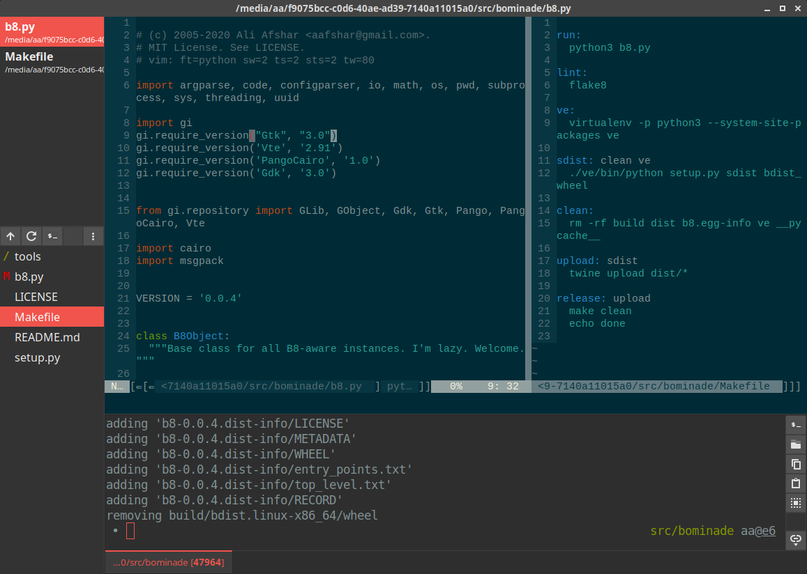

# bominade (b8)

**Vim-based IDE**

Bominade is the successor to a8 and PIDA. It is an extremely light-weight IDE
based on NeoVim, a file browser and a terminal emulator. It is currently in
heavy development.

## Features

* NeoVim - that's right, use all your Vim and NeoVim plugins. The NeoVim integration uses LineGrid and renders using Cairo. It's pretty fast and comparable with Vim-gtk
* Proper terminal emulator - this has real PTY support and uses VTE, the backend to gnome-terminal and xfce4-terminal.
* File manager with Git integration - see the statuses of your files directly in the file manager
* Open files in the terminal emulator or file browser just by clicking on them
* Sync terminal emulator working directory with the file manager to auto-browse when you cd
* Terminal themes - love solarized-dark? Great, use it.
* Vim Buffer list - literally the only missing thing from Vim and we provide a nice way to view the path name and the parent directory
* Works on Linux - this thing hasn't been tested on other platforms where it probably works, but we care about Linux

## Obligatory screenshot

This is what we mean...



## Getting started

I only tested it on an old LTS ubuntu.

You will need a few dependencies: NeoVim, python3, gtk, vte, msgpack.

Something like this should be enough, but let me know:

```
# apt install python3 python3-gi python3-gi-cairo libvte-2.91-0 python3-msgpack neovim
```

It uses NeoVim's non-deprecated linegrid methodology, so you need a reasonably
recent NeoVim. I use 0.4.4-1 from ppa, but the stock in the latest LTS Ubuntu
works too.

Then just run the script:

```
$ python3 b8.py
```

## Config

Set up your NeoVim however you like it. Yummy!

Nothing yet for terminals, but coming soon. I'm sorry.
